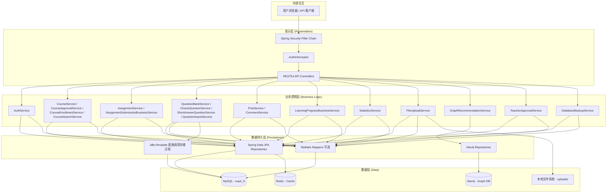
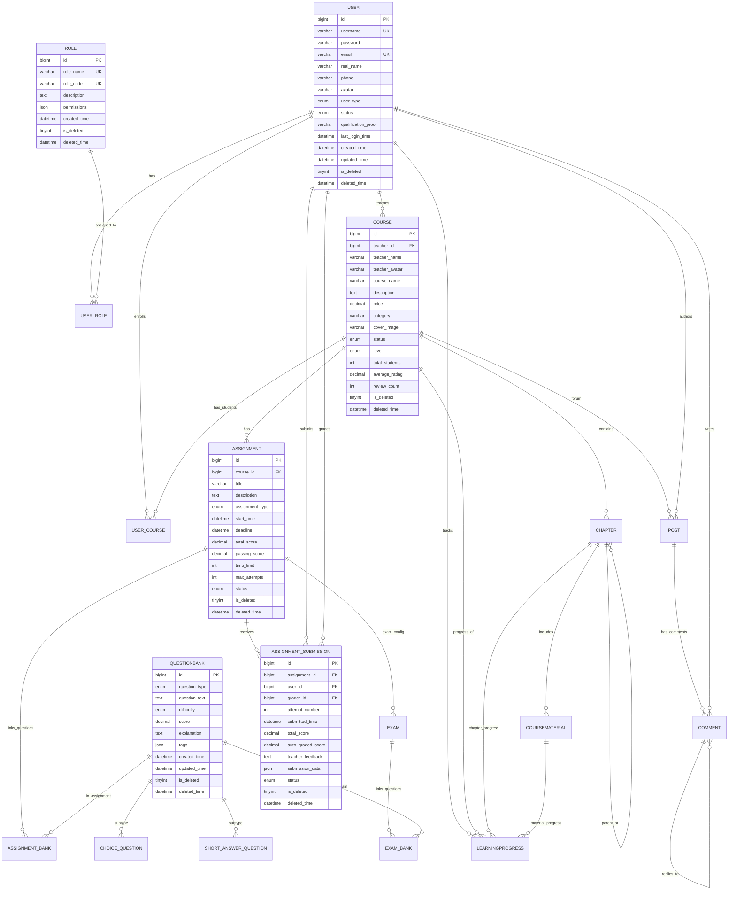
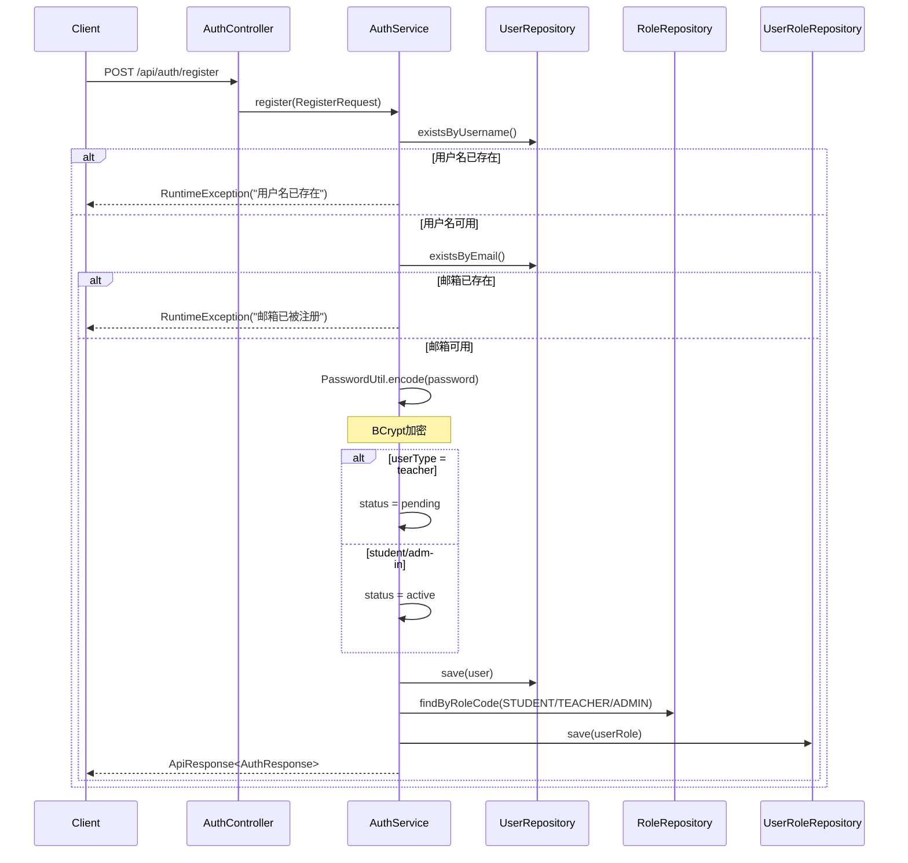
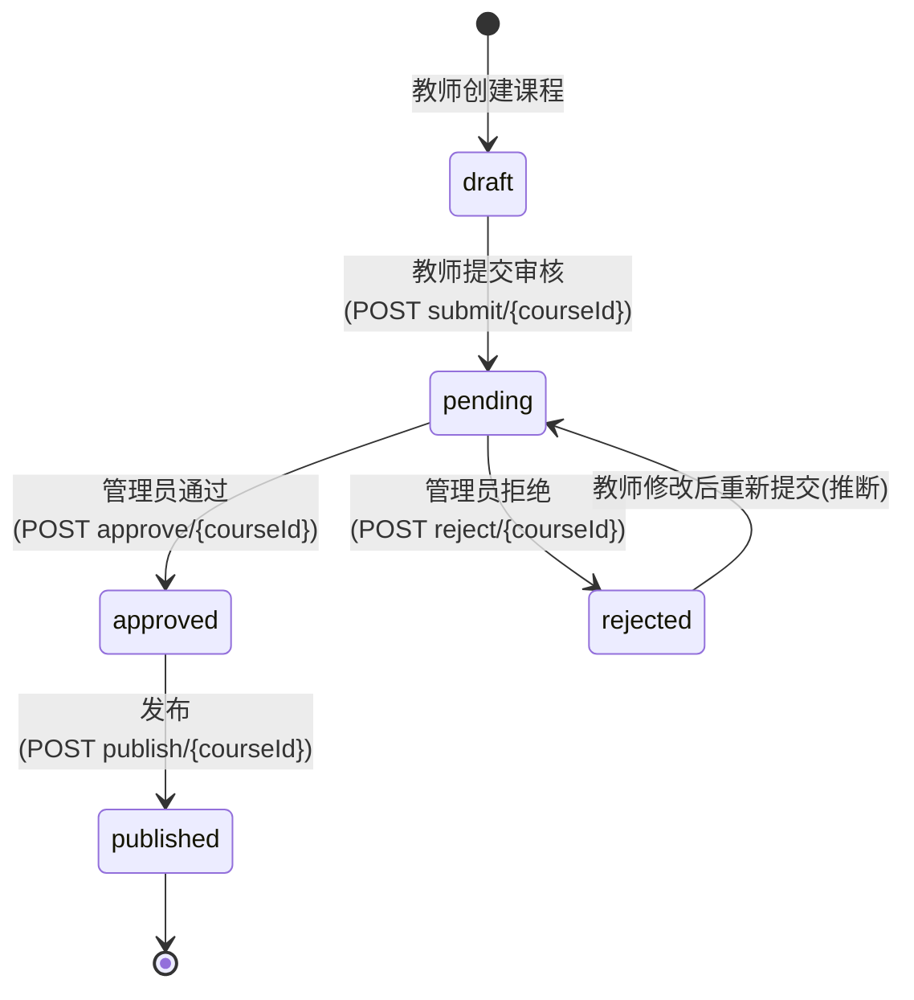
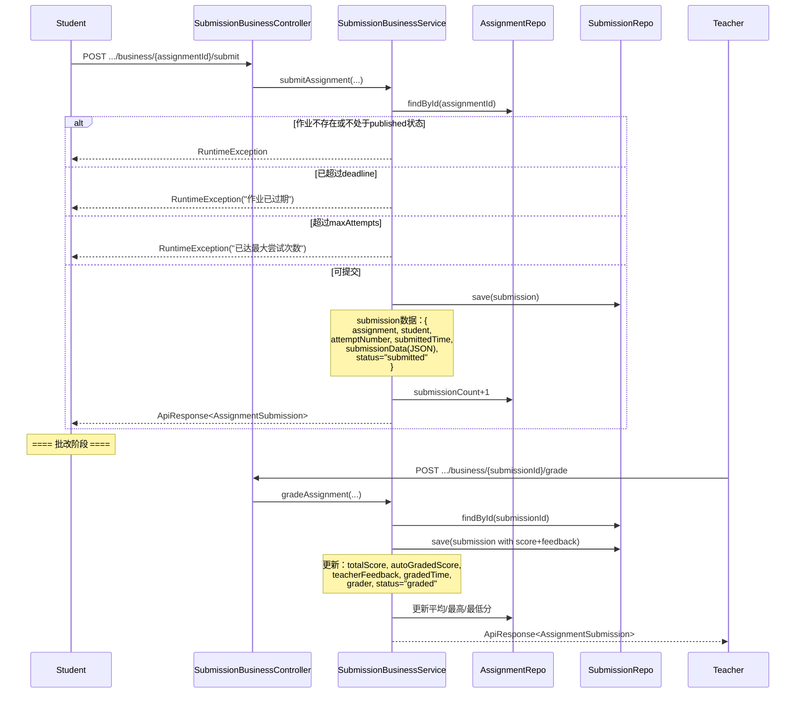

# 项目详细说明文档

> **适用对象**：软件测试团队成员  
> **文档用途**：帮助测试团队快速理解 TeachingSys 教学管理系统的全部功能、架构和实现细节，支持《软件质量保证与测试》课程的黑盒测试、白盒测试、单元测试、集成测试、接口测试和系统测试。

---

## 1 项目概述

### 1.1 编写目的

本文档面向软件测试团队成员（包括测试分析、用例设计、测试执行人员），旨在：

- 系统、完整地介绍 TeachingSys 教学管理平台的功能、架构、接口和数据模型。
- 为测试人员提供可直接用于测试分析和用例设计的事实依据。
- 提供可复现的环境搭建步骤、测试数据脚本和完整的接口清单。
- 覆盖黑盒、白盒、单元、集成、接口、系统测试所需的所有技术细节。

> **注意**：本项目未提供独立的产品规格说明书（PRD），以下功能规格均根据实际代码逆向分析得出。

### 1.2 项目背景与简介

**TeachingSys（教学管理系统）** 是一个面向在线教育的综合管理平台，核心解决教师开课、课程管理、学生选课学习、作业布置与批改、题目管理、论坛互动、学习进度追踪等在线教学场景中的全流程管理问题。

**面向用户群体**：
- **学生**：浏览/搜索/报名课程、学习章节资料、提交作业、论坛发帖、查看学习进度。
- **教师**：创建/管理课程、发布章节和资料、布置作业/考试、批改作业、查看学生统计。
- **管理员**：审核教师资质、审批课程、管理系统配置、查看全局统计数据。

**项目名称**：`teachingSys`（Maven Artifact: `com.teach:teachingSys`）

**主要技术栈**：

| 技术 | 版本/说明 |
|------|----------|
| Spring Boot | 3.5.9 |
| JDK | 21 |
| 构建工具 | Maven |
| 数据库 MySQL | 8.x（数据库名：`exp4_6`，端口：3307） |
| ORM | Spring Data JPA (Hibernate) + MyBatis 3.0.5 |
| 缓存 | Redis（本地 6379） |
| 图数据库 | Neo4j（Bolt 7687，用于课程推荐） |
| 安全框架 | Spring Security + Session 认证 |
| 密码加密 | BCryptPasswordEncoder |
| 监控 | Spring Boot Actuator |
| 文件存储 | 本地文件系统 |
| JSON 处理 | Jackson + jackson-datatype-jsr310 |

**主要功能模块**：

| 模块 | 职责 |
|------|------|
| 用户认证与授权 | 注册、登录、登出、Session 管理、角色分配 |
| 用户管理 | 用户 CRUD、按用户名/邮箱查询 |
| 角色管理 | 角色 CRUD、角色-用户关联管理 |
| 教师审核 | 教师注册审核流程（管理员审批） |
| 课程管理 | 课程 CRUD、课程审核与发布流程 |
| 课程搜索 | 多条件搜索、分类浏览、热门课程 |
| 课程报名 | 学生报名/退课、我的课程、报名状态检查 |
| 章节管理 | 课程章节树形结构管理（支持父子章节） |
| 课程资料 | 视频/PPT/PDF/DOC/TEXT 资料管理、下载/观看计数 |
| 作业管理 | 作业创建、发布、截止时间、统计 |
| 作业提交与批改 | 学生在线提交、教师批改评分、自动批改成绩 |
| 考试管理 | 考试配置（随机打乱、显示答案、回顾） |
| 题库管理 | 题目主表 + 选择题/简答题子表、标签、难度、分值 |
| 题目导入 | JSON 批量导入（调用存储过程 `sp_import_questions`） |
| 论坛 | 课程讨论区帖子（discussion/question/announcement）、置顶、热度计算 |
| 评论 | 帖子评论、嵌套回复（parent_id）、点赞 |
| 学习进度 | 章节/资料级学习进度追踪、视频观看时间统计 |
| 统计报表 | 报名统计、收入统计、学习情况、作业成绩、综合统计 |
| 文件上传 | 头像、课程封面、课程资料、教师资格证明上传 |
| 课程推荐 | 基于 Neo4j 图数据库的协同过滤推荐（"猜你喜欢"） |
| 数据库备份 | SQL 导出（DDL + DML） |
| 全局软删除 | 所有业务表使用 `is_deleted` + `deleted_time` 实现逻辑删除 |

### 1.3 产品规格说明书（Specification）

> 本项目未提供独立文档，以下已根据代码逆向分析补充。

#### 功能清单

| 编号 | 功能名称 | 功能描述 | 输入/输出 | 业务规则与约束 | 界面/调用方式 |
|------|---------|---------|-----------|---------------|-------------|
| F-001 | 用户注册 | 新用户创建账户。学生直接激活，教师需提交资质证明并等待审批。 | **输入**：RegisterRequest（username, password, email, realName, phone, userType, qualificationProof）<br>**输出**：ApiResponse\<AuthResponse\>（含userId, username, email, realName, userType, status, roles） | 1.用户名唯一 2.邮箱唯一 3.密码BCrypt加密 4.教师注册状态="pending"，学生="active" 5.自动分配默认角色（STUDENT/TEACHER/ADMIN） | `POST /api/auth/register` |
| F-002 | 用户登录 | 验证用户名密码，建立 Session，存储认证信息到 SecurityContext。 | **输入**：LoginRequest（username, password）<br>**输出**：ApiResponse\<AuthResponse\> + Session（userId） | 1.用户名+密码匹配 2.被禁用账户（inactive）无法登录 3.登录成功更新 lastLoginTime 4.限制同一用户最多1个Session 5.Session中存储Spring Security Context | `POST /api/auth/login` |
| F-003 | 用户登出 | 销毁服务端 Session。 | **输入**：无（需已登录）<br>**输出**：ApiResponse\<Void\> | 销毁当前 HttpSession | `POST /api/auth/logout` |
| F-004 | 获取当前用户 | 返回当前登录用户信息。 | **输入**：Session 中 userId<br>**输出**：ApiResponse\<AuthResponse\> | 需已登录，否则返回 401 | `GET /api/auth/me` |
| F-005 | 用户 CRUD | 管理用户信息。 | **输入/输出**：User 实体<br>**分页**：pageable（默认 size=20） | 删除为软删除（is_deleted=1） | `POST/GET/PUT/DELETE /api/users` |
| F-006 | 角色管理 | 管理系统角色（role_name, role_code, permissions）。 | **输入/输出**：Role 实体 | role_code唯一，role_name唯一 | `POST/GET/PUT/DELETE /api/roles` |
| F-007 | 用户角色分配 | 为用户分配/管理角色。 | **输入/输出**：UserRole 实体 | user_id+role_id 组合唯一 | `POST/GET/PUT/DELETE /api/user-roles` |
| F-008 | 教师审核 | 管理员审核教师注册申请。 | **输入**：teacherId<br>**输出**：ApiResponse\<User\> | 1.仅管理员可操作 2.通过→status=active 3.拒绝→status=inactive 4.非teacher类型拒绝 | `GET /api/teacher-approval/pending`<br>`POST /api/teacher-approval/approve/{teacherId}`<br>`POST /api/teacher-approval/reject/{teacherId}` |
| F-009 | 课程创建 | 教师创建课程。 | **输入**：Course 实体（含 teacher 对象, courseName, description, price, category, coverImage, level）<br>**输出**：Course 实体 | 1.自动同步 teacherName/teacherAvatar 冗余字段 2.初始状态="draft" | `POST /api/courses` |
| F-010 | 课程审核流程 | 课程生命周期管理：draft → pending → approved → published（或 rejected）。 | **输入**：courseId, reason（拒绝时）<br>**输出**：ApiResponse\<Course\> | 1.提交审核→status=pending 2.通过→status=approved, 记录approvalTime 3.发布→必须先approved, status=published 4.拒绝→status=rejected, 记录rejectionReason | `POST /api/course-approval/submit/{courseId}`<br>`POST .../approve/{courseId}`<br>`POST .../publish/{courseId}`<br>`POST .../reject/{courseId}`<br>`GET .../pending` |
| F-011 | 课程搜索 | 多条件组合搜索课程。 | **输入**：keyword, category, level, minPrice, maxPrice, status, page, size, sortBy, sortDir<br>**输出**：Page\<Course\> | 支持按分类、难度、价格范围、状态筛选，分页排序 | `GET /api/course-search/search` |
| F-012 | 分类/热门/教师课程 | 按维度浏览课程。 | **输出**：Page\<Course\> | 热门课程按报名人数等排序(推断) | `GET /api/course-search/category/{category}`<br>`GET /api/course-search/teacher/{teacherId}`<br>`GET /api/course-search/popular` |
| F-013 | 课程报名 | 学生报名已发布课程。 | **输入**：courseId + Session userId<br>**输出**：ApiResponse\<UserCourse\> | 1.课程必须已发布(published) 2.不可重复报名 3.报名后course.totalStudents+1 4.异步同步到Neo4j用于推荐 5.状态="active" | `POST /api/course-enrollment/{courseId}` |
| F-014 | 我的课程 | 查看已报名课程列表。 | **输出**：ApiResponse\<List\<UserCourse\>\> | 需登录 | `GET /api/course-enrollment/my-courses` |
| F-015 | 报名状态检查 | 检查是否已报名某课程。 | **输出**：ApiResponse\<Boolean\> | 需登录 | `GET /api/course-enrollment/check/{courseId}` |
| F-016 | 章节管理 | 课程章节树形结构管理，支持父子章节。 | **输入/输出**：Chapter 实体 | 1.必须属于某课程 2.parent_id可指向父章节 3.按chapter_order排序 4.父章节删除级联子章节 | `POST/GET/PUT/DELETE /api/chapters` |
| F-017 | 课程资料管理 | 章节下挂载视频/PPT/PDF/DOC/TEXT资料。 | **输入/输出**：CourseMaterial 实体 | 1.必须属于某章节 2.materialType为enum（video/ppt/pdf/doc/text） 3.记录下载次数和观看次数 4.视频记录时长duration | `POST/GET/PUT/DELETE /api/course-materials` |
| F-018 | 作业管理 | 教师创建/发布作业或考试。 | **输入/输出**：Assignment 实体 | 1.类型：homework(作业) / exam(考试) 2.状态：draft→published→closed 3.含截止时间deadline 4.总分/及格分/时间限制/最大尝试次数 5.含统计字段（提交数/批改数/平均/最高/最低分） | `POST/GET/PUT/DELETE /api/assignments` |
| F-019 | 作业提交 | 学生在线提交作业答案。 | **输入**：assignmentId + JSON submissionData（Map<String,String>，key=题目ID, value=答案）<br>**输出**：ApiResponse\<AssignmentSubmission\> | 1.作业必须已发布(published) 2.不可超过截止时间 3.不可超过maxAttempts 4.同尝试次数不可重复提交 5.提交后assignment.submissionCount+1 | `POST /api/assignment-submissions/business/{assignmentId}/submit` |
| F-020 | 作业批改 | 教师对提交评分并给出反馈。 | **输入**：submissionId, totalScore, autoGradedScore, feedback<br>**输出**：ApiResponse\<AssignmentSubmission\> | 1.提交记录必须存在 2.批改人必须存在 3.状态变为"graded" 4.自动更新作业统计（平均/最高/最低分、批改数） | `POST /api/assignment-submissions/business/{submissionId}/grade` |
| F-021 | 提交列表查询 | 学生查看自己的提交，教师查看某作业所有提交。 | **输出**：ApiResponse\<List\<AssignmentSubmission\>\> | 学生只能看自己的，教师可看作业维度所有提交 | `GET /api/assignment-submissions/business/my-submissions`<br>`GET /api/assignment-submissions/business/assignment/{assignmentId}` |
| F-022 | 提交详情 | 获取提交的完整详情（含题目、选项、学生答案、正确答案）。 | **输出**：ApiResponse\<SubmissionDetailResponse\>（含QuestionDetailResponse列表） | 1.submissionData解析为Map 2.根据题目类型查choice/short_answer子表获取选项和正确答案 | `GET /api/assignment-submissions/business/{submissionId}/detail` |
| F-023 | 题库管理 | 题目的主表管理。 | **输入/输出**：QuestionBank 实体 | 1.类型：choice(选择题) / short_answer(简答题) 2.难度：easy/medium/hard 3.分值score 4.标签tags(JSON) 5.答案解析explanation | `POST/GET/PUT/DELETE /api/question-banks` |
| F-024 | 选择题管理 | 选择题详细信息（6个选项A-F，正确答案，是否多选）。 | **输入/输出**：ChoiceQuestion 实体 | 1.question_id唯一关联questionbank 2.correct_answer如"A"、"AB"、"BCD" 3.is_multiple标记多选 | `POST/GET/PUT/DELETE /api/choice-questions` |
| F-025 | 简答题管理 | 简答题详细信息（参考答案、答案长度限制）。 | **输入/输出**：ShortAnswerQuestion 实体 | question_id唯一关联questionbank | `POST/GET/PUT/DELETE /api/short-answer-questions` |
| F-026 | 题目批量导入 | 通过JSON批量导入题目到题库，并可关联到作业。 | **输入**：ImportQuestionsRequest（courseId, assignmentId, questions:<br>JSON数组）<br>**输出**：ImportQuestionsResponse（importedCount, errorCount, message, errorDetails） | 1.调用存储过程sp_import_questions 2.questions为JSON数组 3.每道题必须是choice或short_answer类型 4.选择题必须提供correct_answer 5.支持事务回滚 6.导入后自动更新作业总分 | `POST /api/questions/import` |
| F-027 | 作业-题目关联 | 管理作业与题目的关联关系及排列顺序。 | **输入/输出**：AssignmentBank 实体 | assignment_id+question_id组合唯一 | `POST/GET/PUT/DELETE /api/assignment-banks` |
| F-028 | 考试配置 | 针对作业类型为"exam"的额外配置。 | **输入/输出**：Exam 实体 | 1.assignment_id唯一关联 2.shuffle_questions:是否打乱顺序 3.show_correct_answer:是否显示正确答案 4.allow_review:是否允许回顾 | `POST/GET/PUT/DELETE /api/exams` |
| F-029 | 考试-题目关联 | 管理考试与题目的关联关系。 | **输入/输出**：ExamBank 实体 | exam_id+question_id组合唯一 | `POST/GET/PUT/DELETE /api/exam-banks` |
| F-030 | 论坛帖子 | 课程讨论区帖子管理。 | **输入/输出**：Post 实体 | 1.类型：discussion(讨论)/question(提问)/announcement(公告) 2.状态：normal/pinned/deleted 3.含统计字段：查看数、回复数、热度分数 4.冗余作者姓名和头像 | `POST/GET/PUT/DELETE /api/posts` |
| F-031 | 帖子评论 | 帖子下的评论与回复（支持嵌套）。 | **输入/输出**：Comment 实体 | 1.parent_id可指向父评论实现嵌套回复 2.状态：normal/deleted 3.含点赞数 4.删除帖子级联删除评论 | `POST/GET/PUT/DELETE /api/comments` |
| F-032 | 学习进度（章节级） | 记录和更新学生对章节的学习进度。 | **输入**：courseId, chapterId, completionPercentage<br>**输出**：ApiResponse\<LearningProgress\> | 1.同一用户+章节唯一 2.100%完成→status=completed 3.自动更新UserCourse进度统计 | `POST /api/learning-progress/chapter` |
| F-033 | 学习进度（资料级） | 记录和更新学生对资料的学习进度（含视频观看时间）。 | **输入**：courseId, materialId, watchTime, totalTime<br>**输出**：ApiResponse\<LearningProgress\> | 1.观看90%以上视为完成 2.自动计算完成百分比 3.记录视频类型资料观看时间 | `POST /api/learning-progress/material` |
| F-034 | 学习进度查询 | 查询学生的学习进度。 | **输出**：ApiResponse\<List\<LearningProgress\>\> | 可选过滤courseId | `GET /api/learning-progress` |
| F-035 | 统计报表 | 多维度统计查询。 | 详见下方统计接口表 | — | `GET /api/statistics/*` |
| F-036 | 文件上传 | 上传头像、课程资料、资质证明、课程封面。 | **输入**：MultipartFile + 分类<br>**输出**：ApiResponse\<Map\<url, size, originalName\>\> | 1.头像/封面：仅图片 2.资质证明：PDF或图片 3.最大100MB 4.文件存储到本地uploads/目录 5.按分类/日期组织目录 6.UUID重命名 | `POST /api/upload/avatar`<br>`POST .../course-material`<br>`POST .../qualification-proof`<br>`POST .../course-cover`<br>`DELETE /api/upload` |
| F-037 | 课程推荐 | 基于Neo4j协同过滤推荐课程（"选了这个课的人也选了..."）。 | **输入**：studentId<br>**输出**：ApiResponse\<List\<GraphCourseRecommendationDto\>\>（id, name, frequency） | 1.基于Neo4j图查询 2.协同过滤算法 3.取频率最高的5门课 | `GET /api/recommendations/{studentId}` |
| F-038 | 数据库导出 | 导出全库SQL备份（DDL+DML）。 | **输出**：SQL文件下载 | 含SET FOREIGN_KEY_CHECKS处理 | `GET /api/system/export-sql` |
| F-039 | 健康检查 | Spring Boot Actuator 端点。 | **输出**：JSON | health, info, metrics 开放 | `GET /actuator/health` |

#### 通用特性

| 特性 | 说明 |
|------|------|
| 认证机制 | Session 认证（Spring Security + 手动 SecurityContext 写入）+ AuthInterceptor 拦截器双重校验 |
| 权限控制 | Spring Security 链：`/api/auth/**` permitAll，其余 `/api/**` 需 authenticated |
| 软删除 | 所有业务实体使用 `@SQLDelete(sql = "UPDATE ... SET is_deleted = 1, deleted_time = NOW() WHERE id = ?")` + `@Where(clause = "is_deleted = 0")` |
| 密码安全 | BCrypt 加密存储 |
| Session 限制 | 同一用户最多 1 个并发 Session |
| CSRF | 已禁用（因使用 Session 管理） |
| 统一响应 | ApiResponse\<T\>：success（boolean）、message（String）、data（T） |
| 缓存 | Redis 缓存，TTL 分级：course 60min / user 30min / questionBank 60min / exam 30min / system 24h |
| 事务 | Service 层 `@Transactional`，JPA 事务管理器为主，Neo4j 独立事务管理器 |

### 1.4 设计文档

#### 1.4.1 系统架构



**架构风格**：经典 MVC 分层架构。

- **选型理由**：
  - Spring Boot MVC 三层分离（Controller → Service → Repository），职责清晰。
  - MySQL 为主数据库，存储所有业务数据。
  - Redis 作为二级缓存，缓解数据库读压力（@Cacheable/@CacheEvict 注解驱动）。
  - Neo4j 作为图数据库独立存储选课关系，支撑协同过滤课程推荐（独立事务管理器，Neo4j 不可用不影响主业务）。
  - Session 认证机制简单可靠，适合单体应用。

#### 1.4.2 技术栈详情

从 `pom.xml` 提取的核心依赖：

| 依赖 | 版本 | 用途 |
|------|------|------|
| spring-boot-starter-web | 3.5.9 | RESTful Web 应用基础 |
| spring-boot-starter-security | 3.5.9 | 认证与授权 |
| spring-boot-starter-data-jpa | 3.5.9 | JPA/Hibernate ORM |
| spring-boot-starter-data-redis | 3.5.9 | Redis 缓存集成 |
| spring-boot-starter-data-neo4j | 3.5.9 | Neo4j 图数据库集成 |
| spring-boot-starter-actuator | 3.5.9 | 应用监控与健康检查 |
| mybatis-spring-boot-starter | 3.0.5 | MyBatis 持久层支持 |
| mysql-connector-j | (runtime) | MySQL JDBC 驱动 |
| spring-boot-devtools | (runtime) | 开发热重载 |
| lombok | (optional) | 减少样板代码 |
| jackson-datatype-jsr310 | — | Java 8 时间类型 JSON 序列化 |
| spring-boot-starter-test | (test) | Spring Boot 测试支持 |
| mybatis-spring-boot-starter-test | 3.0.5 | MyBatis 测试支持 |
| spring-security-test | (test) | Spring Security 测试支持 |

#### 1.4.3 数据库设计

##### ER 图



##### 数据库表清单

###### 1. questionbank（题库表）

| 字段名 | 数据类型 | 长度 | 主键 | 外键 | 约束 | 说明 |
|--------|---------|------|------|------|------|------|
| id | bigint | — | PK | — | AUTO_INCREMENT | 题目ID |
| question_type | enum('choice','short_answer') | — | — | — | NOT NULL | 题目类型 |
| question_text | text | — | — | — | NOT NULL | 题目内容 |
| difficulty | enum('easy','medium','hard') | — | — | — | DEFAULT 'medium' | 难度 |
| score | decimal(5,2) | — | — | — | DEFAULT 1.00 | 分值 |
| explanation | text | — | — | — | — | 答案解析 |
| tags | json | — | — | — | — | 标签 |
| created_time | datetime | — | — | — | DEFAULT CURRENT_TIMESTAMP | 创建时间 |
| updated_time | datetime | — | — | — | ON UPDATE CURRENT_TIMESTAMP | 更新时间 |
| is_deleted | tinyint(1) | — | — | — | DEFAULT 0 | 软删除标记 |
| deleted_time | datetime | — | — | — | — | 删除时间 |

###### 2. choice_question（选择题表）

| 字段名 | 数据类型 | 长度 | 主键 | 外键 | 约束 | 说明 |
|--------|---------|------|------|------|------|------|
| id | bigint | — | PK | — | AUTO_INCREMENT | 选择题ID |
| question_id | bigint | — | — | FK→questionbank.id | UNIQUE, ON DELETE CASCADE | 题目ID |
| option_a | text | — | — | — | — | 选项A |
| option_b | text | — | — | — | — | 选项B |
| option_c | text | — | — | — | — | 选项C |
| option_d | text | — | — | — | — | 选项D |
| option_e | text | — | — | — | — | 选项E |
| option_f | text | — | — | — | — | 选项F |
| correct_answer | varchar(10) | 10 | — | — | NOT NULL | 正确答案 |
| is_multiple | tinyint(1) | — | — | — | DEFAULT 0 | 是否多选题 |
| is_deleted | tinyint(1) | — | — | — | DEFAULT 0 | 软删除标记 |
| deleted_time | datetime | — | — | — | — | 删除时间 |

###### 3. short_answer_question（简答题表）

| 字段名 | 数据类型 | 长度 | 主键 | 外键 | 约束 | 说明 |
|--------|---------|------|------|------|------|------|
| id | bigint | — | PK | — | AUTO_INCREMENT | 简答题ID |
| question_id | bigint | — | — | FK→questionbank.id | UNIQUE, ON DELETE CASCADE | 题目ID |
| reference_answer | text | — | — | — | — | 参考答案 |
| answer_length_limit | int | — | — | — | — | 答案长度限制 |
| is_deleted | tinyint(1) | — | — | — | DEFAULT 0 | 软删除标记 |
| deleted_time | datetime | — | — | — | — | 删除时间 |

###### 4. role（角色表）

| 字段名 | 数据类型 | 长度 | 主键 | 外键 | 约束 | 说明 |
|--------|---------|------|------|------|------|------|
| id | bigint | — | PK | — | AUTO_INCREMENT | 角色ID |
| role_name | varchar(50) | 50 | — | — | UNIQUE, NOT NULL | 角色名称 |
| role_code | varchar(50) | 50 | — | — | UNIQUE, NOT NULL | 角色代码 |
| description | text | — | — | — | — | 角色描述 |
| permissions | json | — | — | — | — | 权限列表 |
| created_time | datetime | — | — | — | DEFAULT CURRENT_TIMESTAMP | 创建时间 |
| is_deleted | tinyint(1) | — | — | — | DEFAULT 0 | 软删除标记 |
| deleted_time | datetime | — | — | — | — | 删除时间 |

###### 5. user（用户表）

| 字段名 | 数据类型 | 长度 | 主键 | 外键 | 约束 | 说明 |
|--------|---------|------|------|------|------|------|
| id | bigint | — | PK | — | AUTO_INCREMENT | 用户ID |
| username | varchar(50) | 50 | — | — | UNIQUE, NOT NULL | 用户名 |
| password | varchar(255) | 255 | — | — | NOT NULL | 密码（BCrypt） |
| email | varchar(100) | 100 | — | — | UNIQUE, NOT NULL | 邮箱 |
| real_name | varchar(100) | 100 | — | — | NOT NULL | 真实姓名 |
| phone | varchar(20) | 20 | — | — | — | 手机号 |
| avatar | varchar(255) | 255 | — | — | — | 头像URL |
| user_type | enum('student','teacher','admin') | — | — | — | NOT NULL | 用户类型 |
| status | enum('active','inactive','pending') | — | — | — | DEFAULT 'active' | 状态 |
| qualification_proof | varchar(255) | 255 | — | — | — | 教师资质证明 |
| last_login_time | datetime | — | — | — | — | 最后登录时间 |
| created_time | datetime | — | — | — | DEFAULT CURRENT_TIMESTAMP | 创建时间 |
| updated_time | datetime | — | — | — | ON UPDATE CURRENT_TIMESTAMP | 更新时间 |
| is_deleted | tinyint(1) | — | — | — | DEFAULT 0 | 软删除标记 |
| deleted_time | datetime | — | — | — | — | 删除时间 |

###### 6. course（课程表）

| 字段名 | 数据类型 | 长度 | 主键 | 外键 | 约束 | 说明 |
|--------|---------|------|------|------|------|------|
| id | bigint | — | PK | — | AUTO_INCREMENT | 课程ID |
| teacher_id | bigint | — | — | FK→user.id | NOT NULL, ON DELETE CASCADE | 教师ID |
| teacher_name | varchar(100) | 100 | — | — | — | 教师姓名（冗余） |
| teacher_avatar | varchar(255) | 255 | — | — | — | 教师头像URL（冗余） |
| course_name | varchar(200) | 200 | — | — | NOT NULL | 课程名称 |
| description | text | — | — | — | — | 课程描述 |
| price | decimal(10,2) | — | — | — | DEFAULT 0.00 | 课程价格 |
| category | varchar(100) | 100 | — | — | — | 课程分类 |
| cover_image | varchar(255) | 255 | — | — | — | 封面图片 |
| status | enum('draft','pending','approved','rejected','published') | — | — | — | DEFAULT 'draft' | 课程状态 |
| level | enum('beginner','intermediate','advanced') | — | — | — | — | 难度等级 |
| total_students | int | — | — | — | DEFAULT 0 | 报名学生数 |
| average_rating | decimal(3,2) | — | — | — | DEFAULT 0.00 | 平均评分 |
| review_count | int | — | — | — | DEFAULT 0 | 评价数量 |
| stats_updated_time | datetime | — | — | — | — | 统计更新时间 |
| approval_time | datetime | — | — | — | — | 审核通过时间 |
| rejection_reason | text | — | — | — | — | 拒绝原因 |
| created_time | datetime | — | — | — | DEFAULT CURRENT_TIMESTAMP | 创建时间 |
| updated_time | datetime | — | — | — | ON UPDATE CURRENT_TIMESTAMP | 更新时间 |
| is_deleted | tinyint(1) | — | — | — | DEFAULT 0 | 软删除标记 |
| deleted_time | datetime | — | — | — | — | 删除时间 |

###### 7. assignment（作业表）

| 字段名 | 数据类型 | 长度 | 主键 | 外键 | 约束 | 说明 |
|--------|---------|------|------|------|------|------|
| id | bigint | — | PK | — | AUTO_INCREMENT | 作业ID |
| course_id | bigint | — | — | FK→course.id | NOT NULL, ON DELETE CASCADE | 课程ID |
| title | varchar(200) | 200 | — | — | NOT NULL | 作业标题 |
| description | text | — | — | — | — | 作业描述 |
| assignment_type | enum('homework','exam') | — | — | — | NOT NULL | 作业类型 |
| start_time | datetime | — | — | — | — | 开始时间 |
| deadline | datetime | — | — | — | — | 截止时间 |
| total_score | decimal(5,2) | — | — | — | DEFAULT 100.00 | 总分 |
| passing_score | decimal(5,2) | — | — | — | DEFAULT 60.00 | 及格分数 |
| time_limit | int | — | — | — | — | 时间限制（分钟） |
| max_attempts | int | — | — | — | DEFAULT 1 | 最大尝试次数 |
| submission_count | int | — | — | — | DEFAULT 0 | 提交次数 |
| graded_count | int | — | — | — | DEFAULT 0 | 已批改次数 |
| average_score | decimal(5,2) | — | — | — | DEFAULT 0.00 | 平均分 |
| highest_score | decimal(5,2) | — | — | — | DEFAULT 0.00 | 最高分 |
| lowest_score | decimal(5,2) | — | — | — | DEFAULT 0.00 | 最低分 |
| stats_updated_time | datetime | — | — | — | — | 统计更新时间 |
| status | enum('draft','published','closed') | — | — | — | DEFAULT 'draft' | 状态 |
| created_time | datetime | — | — | — | DEFAULT CURRENT_TIMESTAMP | 创建时间 |
| updated_time | datetime | — | — | — | ON UPDATE CURRENT_TIMESTAMP | 更新时间 |
| is_deleted | tinyint(1) | — | — | — | DEFAULT 0 | 软删除标记 |
| deleted_time | datetime | — | — | — | — | 删除时间 |

###### 8. assignment_bank（作业题库关系表）

| 字段名 | 数据类型 | 长度 | 主键 | 外键 | 约束 | 说明 |
|--------|---------|------|------|------|------|------|
| id | bigint | — | PK | — | AUTO_INCREMENT | 关系ID |
| assignment_id | bigint | — | — | FK→assignment.id | NOT NULL, ON DELETE CASCADE | 作业ID |
| question_id | bigint | — | — | FK→questionbank.id | NOT NULL, ON DELETE CASCADE | 题目ID |
| question_order | int | — | — | — | — | 题目顺序 |
| is_deleted | tinyint(1) | — | — | — | DEFAULT 0 | 软删除标记 |
| deleted_time | datetime | — | — | — | — | 删除时间 |

唯一约束：(assignment_id, question_id)

###### 9. assignment_submission（作业提交表）

| 字段名 | 数据类型 | 长度 | 主键 | 外键 | 约束 | 说明 |
|--------|---------|------|------|------|------|------|
| id | bigint | — | PK | — | AUTO_INCREMENT | 提交ID |
| assignment_id | bigint | — | — | FK→assignment.id | NOT NULL, ON DELETE CASCADE | 作业ID |
| user_id | bigint | — | — | FK→user.id | NOT NULL, ON DELETE CASCADE | 学生ID |
| attempt_number | int | — | — | — | DEFAULT 1 | 尝试次数 |
| submitted_time | datetime | — | — | — | DEFAULT CURRENT_TIMESTAMP | 提交时间 |
| total_score | decimal(5,2) | — | — | — | DEFAULT 0.00 | 得分 |
| auto_graded_score | decimal(5,2) | — | — | — | DEFAULT 0.00 | 自动批改分数 |
| teacher_feedback | text | — | — | — | — | 教师反馈 |
| graded_time | datetime | — | — | — | — | 批改时间 |
| grader_id | bigint | — | — | FK→user.id | ON DELETE SET NULL | 批改教师ID |
| submission_data | json | — | — | — | — | 提交内容（JSON） |
| has_question_snapshot | tinyint(1) | — | — | — | DEFAULT 0 | 是否含题目快照 |
| status | enum('submitted','graded','returned') | — | — | — | DEFAULT 'submitted' | 提交状态 |
| is_deleted | tinyint(1) | — | — | — | DEFAULT 0 | 软删除标记 |
| deleted_time | datetime | — | — | — | — | 删除时间 |

唯一约束：(assignment_id, user_id, attempt_number)

###### 10. chapter（章节表）

| 字段名 | 数据类型 | 长度 | 主键 | 外键 | 约束 | 说明 |
|--------|---------|------|------|------|------|------|
| id | bigint | — | PK | — | AUTO_INCREMENT | 章节ID |
| course_id | bigint | — | — | FK→course.id | NOT NULL, ON DELETE CASCADE | 课程ID |
| chapter_name | varchar(200) | 200 | — | — | NOT NULL | 章节名称 |
| chapter_order | int | — | — | — | NOT NULL | 章节顺序 |
| description | text | — | — | — | — | 章节描述 |
| parent_id | bigint | — | — | FK→chapter.id | ON DELETE CASCADE | 父章节ID |
| is_public | tinyint(1) | — | — | — | DEFAULT 1 | 是否公开 |
| created_time | datetime | — | — | — | DEFAULT CURRENT_TIMESTAMP | 创建时间 |
| updated_time | datetime | — | — | — | ON UPDATE CURRENT_TIMESTAMP | 更新时间 |
| is_deleted | tinyint(1) | — | — | — | DEFAULT 0 | 软删除标记 |
| deleted_time | datetime | — | — | — | — | 删除时间 |

###### 11. coursematerial（课程资料表）

| 字段名 | 数据类型 | 长度 | 主键 | 外键 | 约束 | 说明 |
|--------|---------|------|------|------|------|------|
| id | bigint | — | PK | — | AUTO_INCREMENT | 资料ID |
| chapter_id | bigint | — | — | FK→chapter.id | NOT NULL, ON DELETE CASCADE | 章节ID |
| material_name | varchar(200) | 200 | — | — | NOT NULL | 资料名称 |
| material_type | enum('video','ppt','pdf','doc','text') | — | — | — | NOT NULL | 资料类型 |
| file_url | varchar(500) | 500 | — | — | NOT NULL | 文件URL |
| file_size | bigint | — | — | — | — | 文件大小（字节） |
| duration | int | — | — | — | — | 视频时长（秒） |
| description | text | — | — | — | — | 资料描述 |
| download_count | int | — | — | — | DEFAULT 0 | 下载次数 |
| view_count | int | — | — | — | DEFAULT 0 | 观看次数 |
| is_free | tinyint(1) | — | — | — | DEFAULT 0 | 是否免费 |
| material_order | int | — | — | — | — | 资料顺序 |
| created_time | datetime | — | — | — | DEFAULT CURRENT_TIMESTAMP | 创建时间 |
| updated_time | datetime | — | — | — | ON UPDATE CURRENT_TIMESTAMP | 更新时间 |
| is_deleted | tinyint(1) | — | — | — | DEFAULT 0 | 软删除标记 |
| deleted_time | datetime | — | — | — | — | 删除时间 |

###### 12. exam（考试表）

| 字段名 | 数据类型 | 长度 | 主键 | 外键 | 约束 | 说明 |
|--------|---------|------|------|------|------|------|
| id | bigint | — | PK | — | AUTO_INCREMENT | 考试ID |
| assignment_id | bigint | — | — | FK→assignment.id | UNIQUE, ON DELETE CASCADE | 作业ID |
| shuffle_questions | tinyint(1) | — | — | — | DEFAULT 1 | 是否打乱题目 |
| show_correct_answer | tinyint(1) | — | — | — | DEFAULT 0 | 是否显示正确答案 |
| allow_review | tinyint(1) | — | — | — | DEFAULT 1 | 是否允许回顾 |
| settings | json | — | — | — | — | 考试设置（JSON） |
| is_deleted | tinyint(1) | — | — | — | DEFAULT 0 | 软删除标记 |
| deleted_time | datetime | — | — | — | — | 删除时间 |

###### 13. exam_bank（考试题库关系表）

| 字段名 | 数据类型 | 长度 | 主键 | 外键 | 约束 | 说明 |
|--------|---------|------|------|------|------|------|
| id | bigint | — | PK | — | AUTO_INCREMENT | 关系ID |
| exam_id | bigint | — | — | FK→exam.id | NOT NULL, ON DELETE CASCADE | 考试ID |
| question_id | bigint | — | — | FK→questionbank.id | NOT NULL, ON DELETE CASCADE | 题目ID |
| question_order | int | — | — | — | — | 题目顺序 |
| is_deleted | tinyint(1) | — | — | — | DEFAULT 0 | 软删除标记 |
| deleted_time | datetime | — | — | — | — | 删除时间 |

###### 14. learningprogress（学习进度表）

| 字段名 | 数据类型 | 长度 | 主键 | 外键 | 约束 | 说明 |
|--------|---------|------|------|------|------|------|
| id | bigint | — | PK | — | AUTO_INCREMENT | 进度ID |
| user_id | bigint | — | — | FK→user.id | NOT NULL, ON DELETE CASCADE | 用户ID |
| course_id | bigint | — | — | FK→course.id | NOT NULL, ON DELETE CASCADE | 课程ID |
| course_name | varchar(200) | 200 | — | — | — | 课程名称（冗余） |
| chapter_id | bigint | — | — | FK→chapter.id | ON DELETE SET NULL | 章节ID |
| chapter_name | varchar(200) | 200 | — | — | — | 章节名称（冗余） |
| material_id | bigint | — | — | FK→coursematerial.id | ON DELETE SET NULL | 资料ID |
| material_name | varchar(200) | 200 | — | — | — | 资料名称（冗余） |
| material_type | enum('video','ppt','pdf','doc','text') | — | — | — | — | 资料类型（冗余） |
| progress_type | enum('chapter','material') | — | — | — | NOT NULL | 进度类型 |
| status | enum('not_started','in_progress','completed') | — | — | — | DEFAULT 'not_started' | 学习状态 |
| completion_percentage | decimal(5,2) | — | — | — | DEFAULT 0.00 | 完成百分比 |
| video_watch_time | int | — | — | — | DEFAULT 0 | 视频观看时间（秒） |
| total_video_time | int | — | — | — | DEFAULT 0 | 视频总时长（秒） |
| last_studied_time | datetime | — | — | — | — | 最后学习时间 |
| completed_time | datetime | — | — | — | — | 完成时间 |
| notes | text | — | — | — | — | 学习笔记 |
| is_deleted | tinyint(1) | — | — | — | DEFAULT 0 | 软删除标记 |
| deleted_time | datetime | — | — | — | — | 删除时间 |

唯一约束：(user_id, chapter_id) 和 (user_id, material_id)

###### 15. post（帖子表）

| 字段名 | 数据类型 | 长度 | 主键 | 外键 | 约束 | 说明 |
|--------|---------|------|------|------|------|------|
| id | bigint | — | PK | — | AUTO_INCREMENT | 帖子ID |
| course_id | bigint | — | — | FK→course.id | NOT NULL, ON DELETE CASCADE | 课程ID |
| user_id | bigint | — | — | FK→user.id | NOT NULL, ON DELETE CASCADE | 发帖用户ID |
| author_name | varchar(100) | 100 | — | — | — | 发帖人姓名（冗余） |
| author_avatar | varchar(255) | 255 | — | — | — | 发帖人头像URL（冗余） |
| title | varchar(200) | 200 | — | — | NOT NULL | 帖子标题 |
| content | text | — | — | — | NOT NULL | 帖子内容 |
| post_type | enum('discussion','question','announcement') | — | — | — | DEFAULT 'discussion' | 帖子类型 |
| status | enum('normal','pinned','deleted') | — | — | — | DEFAULT 'normal' | 帖子状态 |
| view_count | int | — | — | — | DEFAULT 0 | 查看次数 |
| reply_count | int | — | — | — | DEFAULT 0 | 回复次数 |
| hot_score | int | — | — | — | DEFAULT 0 | 热度分数（计算） |
| stats_updated_time | datetime | — | — | — | — | 统计更新时间 |
| last_reply_time | datetime | — | — | — | — | 最后回复时间 |
| last_reply_author_name | varchar(100) | 100 | — | — | — | 最后回复人 |
| created_time | datetime | — | — | — | DEFAULT CURRENT_TIMESTAMP | 创建时间 |
| updated_time | datetime | — | — | — | ON UPDATE CURRENT_TIMESTAMP | 更新时间 |
| is_deleted | tinyint(1) | — | — | — | DEFAULT 0 | 软删除标记 |
| deleted_time | datetime | — | — | — | — | 删除时间 |

###### 16. comment（评论表）

| 字段名 | 数据类型 | 长度 | 主键 | 外键 | 约束 | 说明 |
|--------|---------|------|------|------|------|------|
| id | bigint | — | PK | — | AUTO_INCREMENT | 评论ID |
| post_id | bigint | — | — | FK→post.id | NOT NULL, ON DELETE CASCADE | 帖子ID |
| user_id | bigint | — | — | FK→user.id | NOT NULL, ON DELETE CASCADE | 评论用户ID |
| parent_id | bigint | — | — | FK→comment.id | ON DELETE CASCADE | 父评论ID |
| content | text | — | — | — | NOT NULL | 评论内容 |
| status | enum('normal','deleted') | — | — | — | DEFAULT 'normal' | 评论状态 |
| like_count | int | — | — | — | DEFAULT 0 | 点赞数 |
| created_time | datetime | — | — | — | DEFAULT CURRENT_TIMESTAMP | 创建时间 |
| updated_time | datetime | — | — | — | ON UPDATE CURRENT_TIMESTAMP | 更新时间 |
| is_deleted | tinyint(1) | — | — | — | DEFAULT 0 | 软删除标记 |
| deleted_time | datetime | — | — | — | — | 删除时间 |

###### 17. user_course（用户课程关系表）

| 字段名 | 数据类型 | 长度 | 主键 | 外键 | 约束 | 说明 |
|--------|---------|------|------|------|------|------|
| id | bigint | — | PK | — | AUTO_INCREMENT | 关系ID |
| user_id | bigint | — | — | FK→user.id | NOT NULL, ON DELETE CASCADE | 学生ID |
| course_id | bigint | — | — | FK→course.id | NOT NULL, ON DELETE CASCADE | 课程ID |
| enrolled_time | datetime | — | — | — | DEFAULT CURRENT_TIMESTAMP | 报名时间 |
| progress_rate | decimal(5,2) | — | — | — | DEFAULT 0.00 | 学习进度百分比 |
| completed_chapters | int | — | — | — | DEFAULT 0 | 已完成章节数 |
| total_chapters | int | — | — | — | DEFAULT 0 | 总章节数 |
| completed_materials | int | — | — | — | DEFAULT 0 | 已完成资料数 |
| total_materials | int | — | — | — | DEFAULT 0 | 总资料数 |
| progress_updated_time | datetime | — | — | — | — | 进度更新时间 |
| last_accessed | datetime | — | — | — | — | 最后访问时间 |
| completion_time | datetime | — | — | — | — | 完成时间 |
| status | enum('active','completed','dropped') | — | — | — | DEFAULT 'active' | 学习状态 |
| is_deleted | tinyint(1) | — | — | — | DEFAULT 0 | 软删除标记 |
| deleted_time | datetime | — | — | — | — | 删除时间 |

唯一约束：(user_id, course_id)

###### 18. user_role（用户角色关系表）

| 字段名 | 数据类型 | 长度 | 主键 | 外键 | 约束 | 说明 |
|--------|---------|------|------|------|------|------|
| id | bigint | — | PK | — | AUTO_INCREMENT | 关系ID |
| user_id | bigint | — | — | FK→user.id | NOT NULL, ON DELETE CASCADE | 用户ID |
| role_id | bigint | — | — | FK→role.id | NOT NULL, ON DELETE CASCADE | 角色ID |
| created_time | datetime | — | — | — | DEFAULT CURRENT_TIMESTAMP | 创建时间 |
| is_deleted | tinyint(1) | — | — | — | DEFAULT 0 | 软删除标记 |
| deleted_time | datetime | — | — | — | — | 删除时间 |

唯一约束：(user_id, role_id)

##### 数据库视图

| 视图名 | 说明 |
|--------|------|
| view_course_forum_complete | 课程论坛完整视图（帖子+课程+评论统计+互动率+最近评论预览+帖子标签） |
| view_course_statistics | 课程统计视图（报名人数+章节数+资料数+帖子数+作业数+平均进度） |
| view_course_students | 课程学生视图（学生详情+报名时间+进度+学习阶段判断+日均进步率） |
| view_question_detail | 题目详情视图（题库+选择题+简答题 LEFT JOIN 整合） |
| view_user_role | 用户角色视图（用户名+角色名） |

##### 存储过程

| 存储过程 | 说明 |
|----------|------|
| sp_generate_student_report(IN p_user_id, IN p_course_id) | 生成学生综合报告（基本信息+课程进度+作业完成+学习时间统计） |
| sp_import_questions(IN p_course_id, IN p_assignment_id, IN p_questions_json) | 批量导入题目（JSON数组→questionbank+choice/short_answer+assignment_bank，事务保护，逐题错误捕获） |

##### 关键表关联和级联操作

- **user ↔ course**：教师1:N课程（teacher_id → user.id，CASCADE删除）
- **user ↔ user_course**：学生N:M课程（CASCADE删除）
- **course → chapter → coursematerial**：课程→章节→资料 逐级CASCADE删除
- **course → assignment → assignment_submission**：课程→作业→提交 逐级CASCADE删除
- **assignment → assignment_bank ← questionbank**：作业N:M题目
- **questionbank → choice_question / short_answer_question**：题库1:1子表（CASCADE删除）
- **assignment → exam**：作业1:1考试配置（CASCADE删除）
- **post → comment**：帖子1:N评论（CASCADE删除），评论自引用（parent_id，CASCADE删除）
- **user → learningprogress**：用户1:N学习进度（CASCADE删除），章节/资料删除时SET NULL

#### 1.4.4 接口设计

##### 通用说明

- **Base URL**：`http://localhost:8080`
- **统一响应格式**：
  ```json
  {
    "success": true,
    "message": "操作成功",
    "data": { ... }
  }
  ```
- **认证 Header**：基于 Cookie/Session（服务端 Session 存储 `userId` 和 Spring Security Context）
- **未认证响应**：HTTP 401，`{"success":false,"message":"未登录或Session已过期"}`
- **分页参数**：`?page=0&size=20&sort=createdTime,desc`（Spring Pageable 默认格式）

##### 接口清单

###### 认证模块 `/api/auth`

| 编号 | URL | Method | 请求参数 | 成功响应 | 认证要求 |
|------|-----|--------|---------|---------|---------|
| API-001 | `/api/auth/register` | POST | Body: RegisterRequest | 201 + ApiResponse\<AuthResponse\> | 无 |
| API-002 | `/api/auth/login` | POST | Body: LoginRequest | 200 + ApiResponse\<AuthResponse\> + Set-Cookie | 无 |
| API-003 | `/api/auth/logout` | POST | — | 200 + ApiResponse\<Void\> | 需登录 |
| API-004 | `/api/auth/me` | GET | — | 200 + ApiResponse\<AuthResponse\> | 需登录 |

**RegisterRequest 示例**：
```json
{
   "username": "teststudent",
   "password": "123456",
   "email": "student@test.com",
   "realName": "测试学生",
   "phone": "13800001111",
   "userType": "student"
}
```

**LoginRequest 示例**：
```json
{
   "username": "teststudent",
   "password": "123456"
}
```

**AuthResponse 示例**：
```json
{
   "success": true,
   "message": "登录成功",
   "data": {
      "userId": 1,
      "username": "teststudent",
      "email": "student@test.com",
      "realName": "测试学生",
      "userType": "student",
      "status": "active",
      "roles": ["STUDENT"]
   }
}
```

**错误响应示例**：
```json
{
   "success": false,
   "message": "用户名或密码错误",
   "data": null
}
```

###### 用户管理 `/api/users`

| 编号 | URL | Method | 请求参数 | 响应 | 认证要求 |
|------|-----|--------|---------|------|---------|
| API-005 | `/api/users` | POST | Body: User | 201 + User | 需登录 |
| API-006 | `/api/users/{id}` | GET | Path | 200 + User | 需登录 |
| API-007 | `/api/users/username/{username}` | GET | Path | 200 + User | 需登录 |
| API-008 | `/api/users/email/{email}` | GET | Path | 200 + User | 需登录 |
| API-009 | `/api/users` | GET | pageable | 200 + Page\<User\> | 需登录 |
| API-010 | `/api/users/{id}` | PUT | Body: User | 200 + User | 需登录 |
| API-011 | `/api/users/{id}` | DELETE | Path | 204 | 需登录 |

###### 角色管理 `/api/roles`

| 编号 | URL | Method | 请求参数 | 响应 | 认证要求 |
|------|-----|--------|---------|------|---------|
| API-012 | `/api/roles` | POST | Body: Role | 201 + Role | 需登录 |
| API-013 | `/api/roles/{id}` | GET | Path | 200 + Role | 需登录 |
| API-014 | `/api/roles/code/{roleCode}` | GET | Path | 200 + Role | 需登录 |
| API-015 | `/api/roles/name/{roleName}` | GET | Path | 200 + Role | 需登录 |
| API-016 | `/api/roles` | GET | pageable | 200 + Page\<Role\> | 需登录 |
| API-017 | `/api/roles/{id}` | PUT | Body: Role | 200 + Role | 需登录 |
| API-018 | `/api/roles/{id}` | DELETE | Path | 204 | 需登录 |

###### 用户角色 `/api/user-roles`

| 编号 | URL | Method | 请求参数 | 响应 | 认证要求 |
|------|-----|--------|---------|------|---------|
| API-019 | `/api/user-roles` | POST | Body: UserRole | 201 + UserRole | 需登录 |
| API-020~024 | 标准CRUD | GET/PUT/DELETE | Path | UserRole/Page\<UserRole\> | 需登录 |

###### 教师审核 `/api/teacher-approval`

| 编号 | URL | Method | 请求参数 | 响应 | 认证要求 |
|------|-----|--------|---------|------|---------|
| API-025 | `/api/teacher-approval/pending` | GET | — | 200 + ApiResponse\<List\<User\>\> | 需登录（管理员） |
| API-026 | `/api/teacher-approval/approve/{teacherId}` | POST | Path | 200 + ApiResponse\<User\> | 需登录（管理员） |
| API-027 | `/api/teacher-approval/reject/{teacherId}` | POST | Path | 200 + ApiResponse\<User\> | 需登录（管理员） |

###### 课程管理 `/api/courses`

| 编号 | URL | Method | 请求参数 | 响应 | 认证要求 |
|------|-----|--------|---------|------|---------|
| API-028 | `/api/courses` | POST | Body: Course | 201 + Course | 需登录 |
| API-029 | `/api/courses/{id}` | GET | Path | 200 + Course | 需登录 |
| API-030 | `/api/courses/teacher/{teacherId}` | GET | Path | 200 + List\<Course\> | 需登录 |
| API-031 | `/api/courses` | GET | pageable | 200 + Page\<Course\> | 需登录 |
| API-032 | `/api/courses/{id}` | PUT | Body: Course | 200 + Course | 需登录 |
| API-033 | `/api/courses/{id}` | DELETE | Path | 204 | 需登录 |

###### 课程审核 `/api/course-approval`

| 编号 | URL | Method | 请求参数 | 响应 | 认证要求 |
|------|-----|--------|---------|------|---------|
| API-034 | `/api/course-approval/submit/{courseId}` | POST | Path | 200 + ApiResponse\<Course\> | 需登录（教师） |
| API-035 | `/api/course-approval/approve/{courseId}` | POST | Path | 200 + ApiResponse\<Course\> | 需登录（管理员） |
| API-036 | `/api/course-approval/publish/{courseId}` | POST | Path | 200 + ApiResponse\<Course\> | 需登录 |
| API-037 | `/api/course-approval/reject/{courseId}` | POST | Body: {"reason":"xxx"} | 200 + ApiResponse\<Course\> | 需登录（管理员） |
| API-038 | `/api/course-approval/pending` | GET | — | 200 + ApiResponse\<List\<Course\>\> | 需登录（管理员） |

###### 课程搜索 `/api/course-search`

| 编号 | URL | Method | 请求参数 | 响应 | 认证要求 |
|------|-----|--------|---------|------|---------|
| API-039 | `/api/course-search/search` | GET | Query: keyword, category, level, minPrice, maxPrice, status, page, size, sortBy, sortDir | 200 + ApiResponse\<Page\<Course\>\> | 需登录 |
| API-040 | `/api/course-search/category/{category}` | GET | Path + pageable | 200 + ApiResponse\<Page\<Course\>\> | 需登录 |
| API-041 | `/api/course-search/teacher/{teacherId}` | GET | Path + pageable | 200 + ApiResponse\<Page\<Course\>\> | 需登录 |
| API-042 | `/api/course-search/popular` | GET | pageable | 200 + ApiResponse\<Page\<Course\>\> | 需登录 |

###### 课程报名 `/api/course-enrollment`

| 编号 | URL | Method | 请求参数 | 响应 | 认证要求 |
|------|-----|--------|---------|------|---------|
| API-043 | `/api/course-enrollment/{courseId}` | POST | Path | 200 + ApiResponse\<UserCourse\> | 需登录 |
| API-044 | `/api/course-enrollment/my-courses` | GET | — | 200 + ApiResponse\<List\<UserCourse\>\> | 需登录 |
| API-045 | `/api/course-enrollment/check/{courseId}` | GET | Path | 200 + ApiResponse\<Boolean\> | 需登录 |

###### 章节管理 `/api/chapters`

| 编号 | URL | Method | 请求参数 | 响应 | 认证要求 |
|------|-----|--------|---------|------|---------|
| API-046~052 | 标准CRUD + by course/parent | POST/GET/PUT/DELETE | — | Chapter/List/Page | 需登录 |

###### 课程资料 `/api/course-materials`

| 编号 | URL | Method | 请求参数 | 响应 | 认证要求 |
|------|-----|--------|---------|------|---------|
| API-053~058 | 标准CRUD + by chapter | POST/GET/PUT/DELETE | — | CourseMaterial/List/Page | 需登录 |

###### 作业管理 `/api/assignments`

| 编号 | URL | Method | 请求参数 | 响应 | 认证要求 |
|------|-----|--------|---------|------|---------|
| API-059~065 | 标准CRUD + by course | POST/GET/PUT/DELETE | — | Assignment/List/Page | 需登录 |

###### 作业提交业务 `/api/assignment-submissions/business`

| 编号 | URL | Method | 请求参数 | 响应 | 认证要求 |
|------|-----|--------|---------|------|---------|
| API-066 | `.../business/{assignmentId}/submit` | POST | Body: {"submissionData":"{...}"} | 200 + ApiResponse\<AssignmentSubmission\> | 需登录 |
| API-067 | `.../business/{submissionId}/grade` | POST | Body: {"totalScore":85,"autoGradedScore":40,"feedback":"Good"} | 200 + ApiResponse\<AssignmentSubmission\> | 需登录（教师） |
| API-068 | `.../business/my-submissions` | GET | Query: assignmentId(optional) | 200 + ApiResponse\<List...\> | 需登录 |
| API-069 | `.../business/assignment/{assignmentId}` | GET | Path | 200 + ApiResponse\<List...\> | 需登录（教师） |
| API-070 | `.../business/{submissionId}/detail` | GET | Path | 200 + ApiResponse\<SubmissionDetailResponse\> | 需登录 |

**SubmissionDetailResponse 示例**：
```json
{
   "success": true,
   "data": {
      "submissionId": 1,
      "assignmentId": 1,
      "assignmentTitle": "第一章作业",
      "studentId": 3,
      "studentName": "张三",
      "totalScore": 85.00,
      "maxScore": 100.00,
      "feedback": "Good job",
      "status": "graded",
      "questions": [
         {
            "questionId": 1,
            "questionText": "1+1=?",
            "questionType": "choice",
            "score": 5.00,
            "optionA": "1",
            "optionB": "2",
            "optionC": "3",
            "optionD": "4",
            "isMultiple": false,
            "studentAnswer": "B",
            "correctAnswer": "B",
            "explanation": "1+1=2"
         }
      ]
   }
}
```

###### 作业提交基础CRUD `/api/assignment-submissions`

| 编号 | URL | Method | 请求参数 | 响应 | 认证要求 |
|------|-----|--------|---------|------|---------|
| API-071~078 | 标准CRUD + by assignment/user/attempt | POST/GET/PUT/DELETE | — | AssignmentSubmission | 需登录 |

###### 题库管理 `/api/question-banks`

| 编号 | URL | Method | 请求参数 | 响应 | 认证要求 |
|------|-----|--------|---------|------|---------|
| API-079~083 | 标准CRUD | POST/GET/PUT/DELETE | — | QuestionBank | 需登录 |

###### 选择题管理 `/api/choice-questions`

| 编号 | URL | Method | 请求参数 | 响应 | 认证要求 |
|------|-----|--------|---------|------|---------|
| API-084~089 | 标准CRUD + by questionId | POST/GET/PUT/DELETE | — | ChoiceQuestion | 需登录 |

###### 简答题管理 `/api/short-answer-questions`

| 编号 | URL | Method | 请求参数 | 响应 | 认证要求 |
|------|-----|--------|---------|------|---------|
| API-090~094 | 标准CRUD + by questionId | POST/GET/PUT/DELETE | — | ShortAnswerQuestion | 需登录 |

###### 题目导入 `/api/questions`

| 编号 | URL | Method | 请求参数 | 响应 | 认证要求 |
|------|-----|--------|---------|------|---------|
| API-095 | `/api/questions/import` | POST | Body: ImportQuestionsRequest | 200 + ApiResponse\<ImportQuestionsResponse\> | 需登录 |

**ImportQuestionsRequest 示例**：
```json
{
   "courseId": 1,
   "assignmentId": 1,
   "questions": [
      {
         "question_type": "choice",
         "question_text": "Java的关键字是？",
         "difficulty": "easy",
         "score": 5,
         "option_a": "String",
         "option_b": "class",
         "option_c": "System",
         "option_d": "out",
         "correct_answer": "B",
         "is_multiple": 0
      },
      {
         "question_type": "short_answer",
         "question_text": "请简述面向对象的特点",
         "difficulty": "medium",
         "score": 10,
         "reference_answer": "封装、继承、多态",
         "answer_length_limit": 500
      }
   ]
}
```

**ImportQuestionsResponse 示例**：
```json
{
   "success": true,
   "message": "成功导入 2 道题目",
   "data": {
      "importedCount": 2,
      "errorCount": 0,
      "message": "成功导入 2 道题目",
      "errorDetails": ""
   }
}
```

###### 作业题库关联 `/api/assignment-banks`

| 编号 | URL | Method | 请求参数 | 响应 | 认证要求 |
|------|-----|--------|---------|------|---------|
| API-096~103 | 标准CRUD + by assignment/question | POST/GET/PUT/DELETE | — | AssignmentBank | 需登录 |

###### 考试管理 `/api/exams`

| 编号 | URL | Method | 请求参数 | 响应 | 认证要求 |
|------|-----|--------|---------|------|---------|
| API-104~109 | 标准CRUD + by assignmentId | POST/GET/PUT/DELETE | — | Exam | 需登录 |

###### 考试题库关联 `/api/exam-banks`

| 编号 | URL | Method | 请求参数 | 响应 | 认证要求 |
|------|-----|--------|---------|------|---------|
| API-110~116 | 标准CRUD + by exam/question | POST/GET/PUT/DELETE | — | ExamBank | 需登录 |

###### 论坛帖子 `/api/posts`

| 编号 | URL | Method | 请求参数 | 响应 | 认证要求 |
|------|-----|--------|---------|------|---------|
| API-117~123 | 标准CRUD + by course/user | POST/GET/PUT/DELETE | — | Post | 需登录 |

###### 评论 `/api/comments`

| 编号 | URL | Method | 请求参数 | 响应 | 认证要求 |
|------|-----|--------|---------|------|---------|
| API-124~131 | 标准CRUD + by post/user/parent | POST/GET/PUT/DELETE | — | Comment | 需登录 |

###### 学习进度 `/api/learning-progress`

| 编号 | URL | Method | 请求参数 | 响应 | 认证要求 |
|------|-----|--------|---------|------|---------|
| API-132 | `/api/learning-progress/chapter` | POST | Body: {"courseId","chapterId","completionPercentage"} | 200 + ApiResponse\<LearningProgress\> | 需登录 |
| API-133 | `/api/learning-progress/material` | POST | Body: {"courseId","materialId","watchTime","totalTime"} | 200 + ApiResponse\<LearningProgress\> | 需登录 |
| API-134 | `/api/learning-progress` | GET | Query: courseId(optional) | 200 + ApiResponse\<List...\> | 需登录 |

###### 学习进度基础CRUD `/api/learning-progresses`

| 编号 | URL | Method | 请求参数 | 响应 | 认证要求 |
|------|-----|--------|---------|------|---------|
| API-135~143 | 标准CRUD + by user/course/chapter/material | POST/GET/PUT/DELETE | — | LearningProgress | 需登录 |

###### 用户课程 `/api/user-courses`

| 编号 | URL | Method | 请求参数 | 响应 | 认证要求 |
|------|-----|--------|---------|------|---------|
| API-144~151 | 标准CRUD + by user/course | POST/GET/PUT/DELETE | — | UserCourse | 需登录 |

###### 统计 `/api/statistics`

| 编号 | URL | Method | 请求参数 | 响应 | 认证要求 |
|------|-----|--------|---------|------|---------|
| API-152 | `/api/statistics/enrollment` | GET | Query: courseId(optional) | 200 + ApiResponse\<Map\> | 需登录 |
| API-153 | `/api/statistics/revenue` | GET | Query: courseId, startDate, endDate | 200 + ApiResponse\<Map\> | 需登录 |
| API-154 | `/api/statistics/learning` | GET | Query: studentId, courseId | 200 + ApiResponse\<Map\> | 需登录 |
| API-155 | `/api/statistics/assignment/{assignmentId}/scores` | GET | Path | 200 + ApiResponse\<Map\> | 需登录 |
| API-156 | `/api/statistics/course/{courseId}/comprehensive` | GET | Path | 200 + ApiResponse\<Map\> | 需登录 |

###### 文件上传 `/api/upload`

| 编号 | URL | Method | 请求参数 | 响应 | 认证要求 |
|------|-----|--------|---------|------|---------|
| API-157 | `/api/upload/avatar` | POST | Multipart: file | 200 + ApiResponse\<Map\> | 需登录 |
| API-158 | `/api/upload/course-material` | POST | Multipart: file | 200 + ApiResponse\<Map\> | 需登录 |
| API-159 | `/api/upload/qualification-proof` | POST | Multipart: file | 200 + ApiResponse\<Map\> | 需登录 |
| API-160 | `/api/upload/course-cover` | POST | Multipart: file | 200 + ApiResponse\<Map\> | 需登录 |
| API-161 | `/api/upload` | DELETE | Query: fileUrl | 200 + ApiResponse\<Void\> | 需登录 |

###### 课程推荐 `/api/recommendations`

| 编号 | URL | Method | 请求参数 | 响应 | 认证要求 |
|------|-----|--------|---------|------|---------|
| API-162 | `/api/recommendations/{studentId}` | GET | Path | 200 + ApiResponse\<List\<GraphCourseRecommendationDto\>\> | 需登录 |

###### 系统工具 `/api/system`

| 编号 | URL | Method | 请求参数 | 响应 | 认证要求 |
|------|-----|--------|---------|------|---------|
| API-163 | `/api/system/export-sql` | GET | — | 200 + SQL文件下载（Content-Type: application/octet-stream） | 需登录 |

###### Actuator 端点

| 编号 | URL | Method | 请求参数 | 响应 | 认证要求 |
|------|-----|--------|---------|------|---------|
| API-164 | `/actuator/health` | GET | — | JSON (UP/DOWN) | 无 |
| API-165 | `/actuator/info` | GET | — | JSON | 无 |
| API-166 | `/actuator/metrics` | GET | — | JSON | 无 |

#### 1.4.5 关键业务流程

##### 用户注册流程



**涉及类和方法**：
- `AuthController.register()` → `AuthService.register()` → `UserRepository.existsByUsername() / existsByEmail() / save()`
- `PasswordUtil.encode()` → BCryptPasswordEncoder
- `AuthService.assignDefaultRole()` → `RoleRepository.findByRoleCode()` + `UserRoleRepository.save()`

##### 课程审核发布流程



**状态流转规则**：
1. 课程创建后默认为 `draft`
2. 教师 `submitForApproval` → `pending`
3. 管理员 `approveCourse` → `approved`（记录 approval_time）
4. 课程必须先 `approved` 才能 `publishCourse` → `published`（否则抛异常）
5. 管理员 `rejectCourse` → `rejected`（必须提供 rejection_reason）

##### 作业提交与批改流程



### 1.5 测试范围

#### 在测范围

| 模块 | 测试类型建议 | 说明 |
|------|-------------|------|
| 用户认证（注册/登录/登出/Session） | 黑盒、接口、安全 | 密码加密、Session生命周期、并发登录限制 |
| 用户/角色/权限 CRUD | 单元、接口、集成 | 软删除验证、唯一约束测试 |
| 教师审核流程 | 黑盒、接口、集成 | 状态流转、权限校验（管理员专属） |
| 课程管理 + 审核发布 | 黑盒、接口、集成 | 状态机流转、数据冗余同步、Redis缓存验证 |
| 课程搜索 | 黑盒、接口 | 多条件组合、分页排序、边界值 |
| 课程报名 | 黑盒、接口、集成 | 报名前置条件、重复报名防护、Neo4j同步 |
| 章节/资料管理 | 接口、集成 | 树形结构、级联删除、排序 |
| 作业管理 + 提交 + 批改 | 黑盒、接口、集成 | 截止时间校验、尝试次数限制、统计计算精度 |
| 题库（题目CRUD + 批量导入） | 黑盒、接口、集成 | 存储过程调用、事务回滚、JSON解析 |
| 论坛（帖子+评论） | 黑盒、接口 | 嵌套评论、状态管理（normal/pinned/deleted） |
| 学习进度追踪 | 接口、集成 | 百分比计算精度、90%完成阈值、UserCourse联动 |
| 统计报表 | 接口 | 聚合计算正确性、空数据边界 |
| 文件上传/删除 | 黑盒、接口 | 文件类型校验、大小限制、目录隔离 |
| 课程推荐（Neo4j） | 接口、集成 | Neo4j连接正常+异常降级场景 |
| 数据库导出 | 接口、系统 | 大数据量导出、特殊字符转义 |
| 全局软删除 | 白盒、集成 | @SQLDelete + @Where 行为 |
| Redis 缓存 | 白盒、单元 | 缓存命中/失效/异常降级 |
| Actuator 端点 | 接口、系统 | 健康检查、指标暴露 |

#### 不在测范围

| 项目 | 原因 |
|------|------|
| Neo4j 集群/高可用 | 开发环境单机部署 |
| Redis 集群/哨兵 | 开发环境单机部署 |
| 第三方支付集成 | 未实现 |
| 邮件/短信通知 | 未实现（虽user有email字段） |
| 分布式Session | 当前为单机Session，未使用Spring Session |
| 前端UI | 项目为纯后端 API，无可测试的前端页面 |
| 弃用接口 | 未发现明显弃用接口 |

#### 各测试类型切入点

- **黑盒测试**：从 API 层测试所有业务功能，关注输入输出、异常处理、业务规则约束。
- **白盒测试**：代码级覆盖软删除逻辑（`@SQLDelete` + `@Where`）、缓存注解（`@Cacheable/@CacheEvict`）、事务边界。
- **单元测试**：Service 层方法（Mock Repository），现有 `CacheLogicTest` 和 `AssignmentSubmissionBusinessControllerTest` 作为参考。
- **集成测试**：Controller + Service + Repository 全链路，重点测试事务回滚、级联操作、存储过程调用。
- **接口测试**：所有 RESTful API，关注 HTTP 状态码、统一响应格式、认证拦截（401场景）、Session过期场景。
- **系统测试**：完整业务流程端到端测试（注册→登录→选课→学习→提交作业→批改→查看统计）。

### 1.6 测试环境与配置

#### 基础软件要求

| 软件 | 推荐版本 | 说明 |
|------|---------|------|
| 操作系统 | Windows/Linux/macOS | 无特殊要求 |
| JDK | 21 | 项目编译和执行运行 |
| Maven | 3.6+ | 构建工具 |
| MySQL | 8.0+ | **端口：3307**，数据库名：`exp4_6`，字符集：`utf8mb4` |
| Redis | 6.0+ | 端口：6379，无密码，database 0 |
| Neo4j | 4.x/5.x | Bolt 端口：7687，用户名：neo4j |

#### 本地运行步骤

**1. 准备数据库**

```bash
# 连接 MySQL（注意端口 3307）
mysql -u root -p -P 3307

# 创建数据库
CREATE DATABASE IF NOT EXISTS exp4_6 CHARACTER SET utf8mb4 COLLATE utf8mb4_unicode_ci;
USE exp4_6;

# 执行初始化脚本（创建表结构）
source F:/ProjectAll/teachingSys/init.sql;

# 执行存储过程脚本
source F:/ProjectAll/teachingSys/procedure.sql;

# 执行视图脚本
source F:/ProjectAll/teachingSys/view.sql;
```

**2. 准备 Redis**

确保 Redis 在 6379 端口启动（无密码）。

**3. 准备 Neo4j**

确保 Neo4j 在 Bolt 7687 端口运行，用户名 `neo4j`，密码 `zs0715zs`。

**4. 配置应用**

编辑 `src/main/resources/application.properties`，确认以下配置与实际环境一致：

```properties
# MySQL
spring.datasource.url=jdbc:mysql://localhost:3307/exp4_6?useUnicode=true&characterEncoding=utf-8&useSSL=false&serverTimezone=Asia/Shanghai
spring.datasource.username=root
spring.datasource.password=zs0715zs

# Redis
spring.data.redis.host=localhost
spring.data.redis.port=6379
spring.data.redis.password=

# Neo4j
spring.neo4j.uri=bolt://localhost:7687
spring.neo4j.authentication.username=neo4j
spring.neo4j.authentication.password=zs0715zs

# File upload
file.upload.path=uploads
file.upload.max-size=104857600
```

**5. 启动应用**

```bash
cd F:/ProjectAll/teachingSys
mvn spring-boot:run
```

或编译后运行：

```bash
mvn clean package -DskipTests
java -jar target/teachingSys-0.0.1-SNAPSHOT.jar
```

应用默认启动在 **8080** 端口。

**6. 验证环境**

```bash
# 检查健康状态
curl http://localhost:8080/actuator/health

# 预期返回：
# {"status":"UP"}

# 测试注册
curl -X POST http://localhost:8080/api/auth/register \
  -H "Content-Type: application/json" \
  -d '{"username":"testuser","password":"123456","email":"test@test.com","realName":"测试用户","userType":"student"}'

# 预期返回 201 Created
```

#### 测试数据初始化 SQL

> 本项目未提供默认测试账号。以下为推荐插入的测试数据：

```sql
-- ==================== 角色数据 ====================
INSERT INTO role (role_name, role_code, description, permissions) VALUES
('学生', 'STUDENT', '学生角色', '{"permissions":["course:view","assignment:submit","post:create"]}'),
('教师', 'TEACHER', '教师角色', '{"permissions":["course:manage","assignment:grade","post:manage"]}'),
('管理员', 'ADMIN', '管理员角色', '{"permissions":["user:manage","course:approve","system:manage"]}');

-- ==================== 用户数据 ====================
-- 密码均为 "123456" 的 BCrypt 加密值
-- 请使用 PasswordUtil.encode("123456") 生成实际值替换
INSERT INTO `user` (username, password, email, real_name, phone, user_type, status) VALUES
('admin', '$2a$10$N.zmdr9k7uOCQb376NoUnuTJ8iAt6Z5EHsM8lE9lBOsl7iAt6Z5Eh', 'admin@test.com', '系统管理员', '13800000000', 'admin', 'active'),
('teacher1', '$2a$10$N.zmdr9k7uOCQb376NoUnuTJ8iAt6Z5EHsM8lE9lBOsl7iAt6Z5Eh', 'teacher1@test.com', '张老师', '13800000001', 'teacher', 'active'),
('teacher2', '$2a$10$N.zmdr9k7uOCQb376NoUnuTJ8iAt6Z5EHsM8lE9lBOsl7iAt6Z5Eh', 'teacher2@test.com', '李老师', '13800000002', 'teacher', 'pending'),
('student1', '$2a$10$N.zmdr9k7uOCQb376NoUnuTJ8iAt6Z5EHsM8lE9lBOsl7iAt6Z5Eh', 'student1@test.com', '王同学', '13800000003', 'student', 'active'),
('student2', '$2a$10$N.zmdr9k7uOCQb376NoUnuTJ8iAt6Z5EHsM8lE9lBOsl7iAt6Z5Eh', 'student2@test.com', '赵同学', '13800000004', 'student', 'active'),
('student3', '$2a$10$N.zmdr9k7uOCQb376NoUnuTJ8iAt6Z5EHsM8lE9lBOsl7iAt6Z5Eh', 'student3@test.com', '刘同学', '13800000005', 'student', 'inactive');

-- ==================== 用户-角色关联 ====================
INSERT INTO user_role (user_id, role_id) VALUES
(1, 3),  -- admin → ADMIN
(2, 2),  -- teacher1 → TEACHER
(3, 2),  -- teacher2 → TEACHER
(4, 1),  -- student1 → STUDENT
(5, 1),  -- student2 → STUDENT
(6, 1);  -- student3 → STUDENT

-- ==================== 课程数据 ====================
INSERT INTO course (teacher_id, teacher_name, course_name, description, price, category, status, level) VALUES
(2, '张老师', 'Java 入门教程', '零基础学习Java编程', 0.00, '编程', 'published', 'beginner'),
(2, '张老师', 'Spring Boot 实战', 'Spring Boot从入门到精通', 99.00, '编程', 'published', 'intermediate'),
(2, '张老师', '数据结构与算法', '面试必备数据结构', 199.00, '计算机基础', 'draft', 'advanced');

-- ==================== 课程报名数据 ====================
INSERT INTO user_course (user_id, course_id, progress_rate) VALUES
(4, 1, 30.00),  -- student1 报名 Java入门，进度30%
(4, 2, 5.00),   -- student1 报名 SpringBoot，进度5%
(5, 1, 60.00),  -- student2 报名 Java入门，进度60%
(5, 2, 0.00);   -- student2 报名 SpringBoot，进度0%
```

> **注意**：由于 BCrypt 每次加密的盐值不同，上方密码 hash 值仅作示例。建议通过调用 `/api/auth/register` 接口或使用 `PasswordUtil.encode("123456")` 生成实际密码密文。

---

## 测试人员快速上手清单

### 环境搭建
- [ ] 确认 JDK 21 已安装：`java -version`
- [ ] 确认 MySQL 8.0+ 运行在端口 3307
- [ ] 创建数据库 `exp4_6`，导入 `init.sql`、`procedure.sql`、`view.sql`
- [ ] 确认 Redis 运行在端口 6379（无密码）
- [ ] 确认 Neo4j 运行在 Bolt 7687（用户名 `neo4j`）
- [ ] 检查 `application.properties` 中的数据库/Redis/Neo4j 连接配置
- [ ] 执行测试数据初始化 SQL
- [ ] 启动应用：`mvn spring-boot:run`
- [ ] 验证：`curl http://localhost:8080/actuator/health`

### 关键接口一览（按测试优先级排序）

| 优先级 | 接口 | 说明 |
|--------|------|------|
| P0 | `/api/auth/register` + `/api/auth/login` + `/api/auth/me` | 认证基础，所有测试前提 |
| P0 | `/api/courses` CRUD + `/api/course-approval/*` | 核心业务，状态机流转 |
| P0 | `/api/course-enrollment/*` | 选课核心流程 |
| P1 | `/api/assignment-submissions/business/*` | 提交+批改+详情，4个端点 |
| P1 | `/api/questions/import` | 批量导入+存储过程 |
| P1 | `/api/learning-progress/*` | 进度更新+联动 |
| P1 | `/api/statistics/*` | 5个统计端点 |
| P2 | `/api/upload/*` | 4个上传+1个删除 |
| P2 | `/api/posts` + `/api/comments` | 论坛功能 |
| P2 | `/api/teacher-approval/*` | 教师审核流程 |
| P2 | `/api/recommendations/{studentId}` | Neo4j推荐 |
| P3 | `/api/roles` + `/api/user-roles` | 权限管理 |
| P3 | `/api/system/export-sql` | 数据库备份 |
| P3 | `/actuator/health` | 监控 |

### 测试重点模块（建议集中关注）

1. **认证与Session管理**：401未登录拦截、Session过期、并发登录限制（maxSessions=1）
2. **课程状态机**：draft→pending→approved→published 流程闭环，rejected后不可直接publish
3. **作业提交业务流程**：未发布不可提交、过期不可提交、超出尝试次数、JSON解析异常处理
4. **题目批量导入**：JSON数组格式验证、题目类型校验、选择题正确答案必填、事务回滚、逐题错误隔离
5. **学习进度计算**：章节100%=completed、视频90%完成阈值、UserCourse进度联动更新
6. **软删除行为**：所有DELETE操作实际为UPDATE is_deleted=1，GET查询自动过滤is_deleted=0的数据
7. **Redis缓存**：课程查询缓存命中/失效、删除后缓存清除、Redis异常降级
8. **Neo4j降级**：Neo4j不可用时选课仍成功（异步同步吞异常）
9. **文件上传**：头像/封面仅图片、资质证明PDF或图片、超过100MB拒收
10. **统计聚合**：空数据场景（无提交/无报名）、除法除零保护
